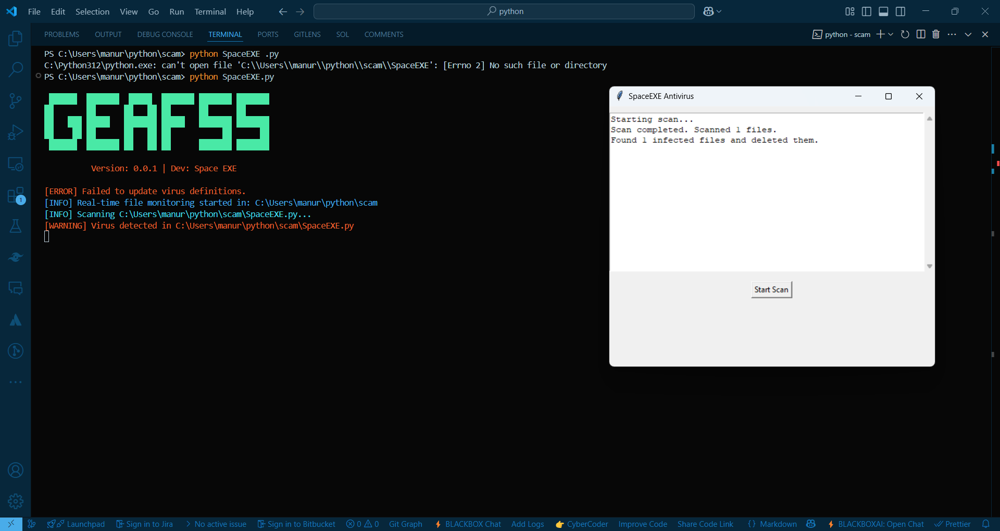

# SpaceEXE Antivirus v0.0.1

🚀 **SpaceEXE Antivirus** is an advanced real-time antivirus tool designed for Python malware detection. It includes real-time monitoring, automatic virus definition updates, and a graphical user interface.
---


## Features
✅ **Real-Time File Monitoring** – Detects new or modified files instantly.
✅ **Cloud-Based Virus Updates** – Always stay up to date with the latest threats.
✅ **Graphical User Interface (GUI)** – Easy-to-use scanning and logging interface.
✅ **Auto-Delete Infected Files** – Removes malware automatically.
✅ **Logging System** – Keeps a record of scanned and deleted files.

## Installation

### 1️⃣ Install Dependencies
```bash
pip install -r requirements.txt
```

### 2️⃣ Run SpaceEXE Antivirus
```bash
python SpaceEXE.py
```


## Usage
- **Manual Scan:** Run the script and enter the directory to scan.
- **Real-Time Protection:** The software automatically scans and removes infected files in real time.
- **GUI Mode:** Run the script to launch the graphical interface.

## Upcoming Features 🚀
🔹 **Email Alerts for Threat Detection**  
🔹 **Machine Learning-based Threat Analysis**  
🔹 **Customizable Scan Settings**  

## Contributing
We welcome contributions! Feel free to open issues and submit pull requests.

## License
📝 This project is licensed under the MIT License.

